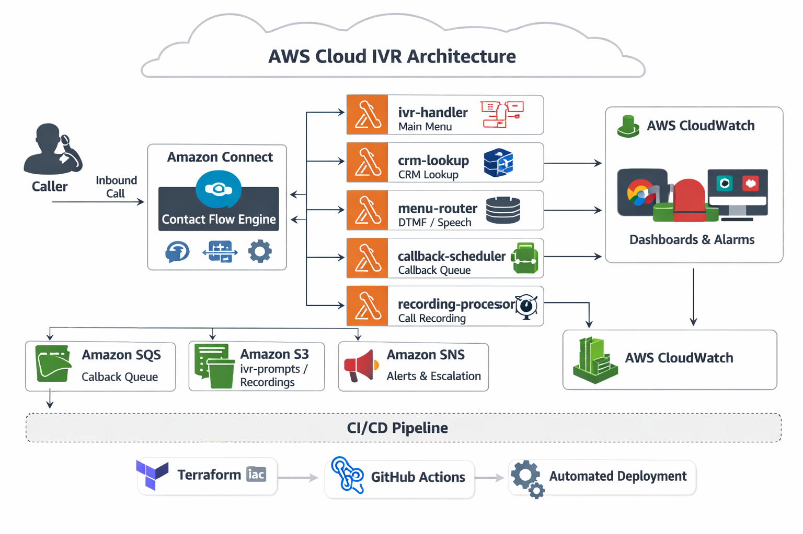

# ☎️ AWS Cloud IVR Architecture

<p align="left">
  
  
  
  
  
</p>

<p align="left">
  
  
  
  
  
  
</p>

Production-grade **Interactive Voice Response (IVR) platform** built on **Amazon Connect**, **AWS Lambda**, **DynamoDB**, **Amazon S3**, **SQS**, **SNS**, and **Terraform** — with **automated CI/CD using GitHub Actions**.

This project demonstrates how to design and deploy a **cloud-native, event-driven, serverless IVR architecture** on AWS for **customer call flows, callback handling, CRM lookup, recording workflows, and operational observability**.

---

## 📌 Project Overview

This architecture is designed to model a **modern enterprise IVR system** using **fully managed AWS services**, minimizing infrastructure overhead while maximizing:

* scalability
* automation
* resiliency
* observability
* deployment repeatability
* operational control

It can be adapted for:

* customer support IVR
* callback automation
* voice self-service
* customer identification workflows
* CRM-assisted support routing
* contact center modernization

---

## 🏗️ Architecture Diagram

> Add your exported architecture image here after creating it.

<p align="center">
  
</p>

---

## 🏗️ Architecture Overview

```text
Caller
  │
  ▼
Amazon Connect (Inbound DID / TFN)
  │
  ├──► Contact Flow Engine
  │         │
  │         ├──► Lambda: ivr-handler         → Main menu routing
  │         ├──► Lambda: crm-lookup          → Caller identification (DynamoDB / API)
  │         ├──► Lambda: menu-router         → DTMF / Speech intent routing
  │         ├──► Lambda: callback-scheduler  → Queue callback + SQS
  │         └──► Lambda: recording-processor → Post-call S3 + transcription
  │
  ├──► DynamoDB
  │         ├── CallerProfiles table
  │         ├── MenuConfig table
  │         └── CallLogs table
  │
  ├──► S3
  │         ├── ivr-audio-prompts/
  │         └── ivr-recordings/
  │
  ├──► SQS        → Callback Queue
  ├──► SNS        → Alerts / Escalation
  └──► CloudWatch → Dashboards + Alarms
```

---

## 🎯 Project Objectives

This project is designed to implement a **cloud-native IVR platform** capable of:

* handling inbound customer call flows through **Amazon Connect**
* routing callers using **DTMF and speech-based logic**
* identifying callers via **CRM / profile lookup**
* scheduling callbacks using **SQS-based workflows**
* storing and processing recordings using **S3 + Lambda**
* monitoring system health and queue behavior with **CloudWatch**
* deploying infrastructure and application components via **Terraform + GitHub Actions**

---

## 🚀 Core Features

### ☎️ Intelligent IVR Flow Management

* Amazon Connect contact flow orchestration
* Main menu and nested call routing
* DTMF and speech-driven interaction handling

### 🧠 Caller Identification & Smart Routing

* CRM / customer profile lookup
* Dynamic call flow personalization
* Menu-based and context-aware routing

### 🔁 Callback Queue Automation

* Queue callback scheduling
* Asynchronous event-driven callback handling
* Scalable queue-based design using SQS

### 🎙️ Recording & Post-Call Processing

* Call recording storage in Amazon S3
* Recording processing via Lambda
* Post-call automation and extensibility

### 📊 Monitoring & Operational Visibility

* CloudWatch dashboards and alarms
* Lambda execution visibility
* Callback queue and wait-time tracking

### ⚙️ Infrastructure as Code & CI/CD

* Terraform-based provisioning
* GitHub Actions automation
* Repeatable deployment workflows

---

## 📦 Technology Stack

| Layer                  | Service                             |
| ---------------------- | ----------------------------------- |
| Contact Center         | Amazon Connect                      |
| Compute                | AWS Lambda (Python 3.12)            |
| Database               | Amazon DynamoDB                     |
| Storage                | Amazon S3                           |
| Queuing                | Amazon SQS                          |
| Notifications          | Amazon SNS                          |
| Secrets                | AWS Secrets Manager                 |
| Infrastructure as Code | Terraform 1.7+                      |
| CI/CD                  | GitHub Actions                      |
| Monitoring             | CloudWatch + Dashboards             |
| Security               | IAM least-privilege, KMS encryption |

---

## 🧱 AWS Services Used

### Amazon Connect

* inbound telephony entry point
* IVR flow orchestration
* customer interaction routing

### AWS Lambda

* `ivr-handler`
* `crm-lookup`
* `menu-router`
* `callback-scheduler`
* `recording-processor`

### DynamoDB

* caller profile storage
* menu configuration
* call logs and interaction metadata

### Amazon S3

* IVR audio prompt storage
* call recording storage
* post-call artifacts / exports

### Amazon SQS / SNS

* callback queueing
* alerting and escalation workflows

### CloudWatch

* operational dashboards
* logging
* alarms
* execution visibility

---

## 🚀 Quick Start

### Prerequisites

```bash
terraform >= 1.7
aws-cli >= 2.x
python >= 3.12
jq
```

---

### 1️⃣ Clone Repository

```bash
git clone https://github.com/swanand18/aws-ivr-architecture.git
cd aws-ivr-architecture
```

---

### 2️⃣ Configure Terraform Variables

```bash
cp terraform/environments/prod/terraform.tfvars.example \
   terraform/environments/prod/terraform.tfvars
```

Update the environment-specific values before deployment.

---

### 3️⃣ Bootstrap Terraform Backend

```bash
bash scripts/bootstrap-backend.sh
```

This initializes remote state infrastructure if configured.

---

### 4️⃣ Deploy Infrastructure

```bash
cd terraform/environments/prod
terraform init
terraform plan -out=tfplan
terraform apply tfplan
```

---

### 5️⃣ Deploy Lambda Functions

```bash
bash scripts/deploy-lambdas.sh prod
```

---

### 6️⃣ Import Amazon Connect Contact Flows

```bash
bash scripts/import-contact-flows.sh prod
```

---

## 📁 Repository Structure

```bash
aws-ivr-architecture/
├── terraform/
│   ├── modules/
│   │   ├── connect/           # Amazon Connect instance + flows
│   │   ├── lambda/            # Lambda functions + IAM
│   │   ├── dynamodb/          # Tables + autoscaling
│   │   ├── s3/                # Buckets + lifecycle
│   │   └── api-gateway/       # CRM / webhook integration
│   └── environments/
│       └── prod/              # Root module + tfvars
│
├── lambda/
│   ├── ivr-handler/           # Main IVR entry point
│   ├── menu-router/           # DTMF / speech routing engine
│   ├── crm-lookup/            # Caller profile lookup
│   ├── callback-scheduler/    # Queue callback logic
│   └── recording-processor/   # Post-call processing
│
├── contact-flows/             # Amazon Connect flow JSON definitions
├── diagrams/                  # Architecture and workflow diagrams
├── scripts/                   # Bootstrap, deploy, import, rollback
├── tests/                     # Unit + integration tests
└── .github/workflows/         # CI/CD pipelines
```

---

## 🔐 Security Controls

This project follows **production-grade AWS security practices**, including:

* S3 buckets with:

  * versioning
  * SSE-KMS encryption
  * block public access
* DynamoDB encryption at rest
* Lambda least-privilege IAM roles
* encrypted recording storage
* Secrets Manager for API keys / CRM credentials
* IAM role separation by function / module

---

## 📊 Monitoring & Alerting

The platform includes monitoring for **availability, latency, failure visibility, and queue behavior**.

| Metric                         | Alarm Threshold |
| ------------------------------ | --------------- |
| Lambda errors                  | > 5 in 5 min    |
| Amazon Connect queue wait time | > 120 sec       |
| DynamoDB throttles             | > 0             |
| SQS callback queue depth       | > 50            |

### Observability Coverage

* Lambda execution logs
* IVR workflow failures
* callback queue depth
* DynamoDB throttling
* queue delay visibility

---

## 🧪 Testing

### Unit Tests

```bash
cd tests
pip install -r requirements.txt
pytest unit/ -v
```

### Integration Tests

```bash
pytest integration/ -v --env=prod
```

---

## 🔄 CI/CD Pipeline

This project uses **GitHub Actions** for infrastructure and application delivery automation.

### Pipeline Capabilities

* Terraform formatting and validation
* Terraform planning
* Lambda packaging and deployment
* environment-aware deployment workflows
* repeatable infrastructure provisioning

### Typical Delivery Workflow

1. Push code to repository
2. GitHub Actions validates Terraform and code
3. Infrastructure changes are reviewed
4. Lambda artifacts are deployed
5. Amazon Connect contact flows are updated

---

## 🎯 Use Cases

This architecture can be adapted for:

* customer support IVR
* callback queue automation
* customer verification flows
* voice self-service systems
* CRM-assisted support routing
* automated post-call processing
* enterprise contact center modernization

---

## 💡 Skills Demonstrated

This project demonstrates practical experience in:

* AWS cloud architecture
* Amazon Connect IVR design
* event-driven serverless workflows
* Terraform-based infrastructure provisioning
* CI/CD automation with GitHub Actions
* queue-based asynchronous processing
* cloud-native monitoring and alerting
* secure infrastructure design

---

## 📝 Author

**Swanand Awatade**
Cloud & DevOps Engineer

📧 **[swanand.awatade@gmail.com](mailto:swanand.awatade@gmail.com)**
🐙 **https://github.com/swanand18**

---

## 📄 License

MIT

---

<p align="center">
  <i>AWS • Amazon Connect • Lambda • Terraform • Serverless • Cloud Architecture</i>
</p>
